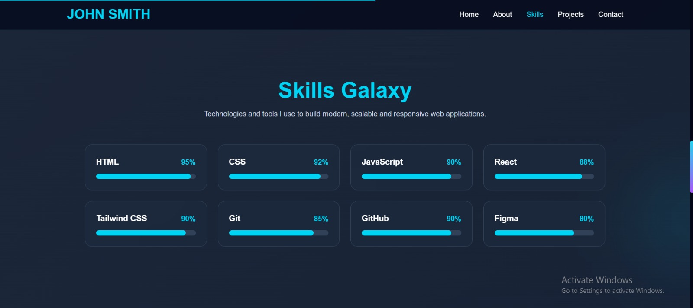
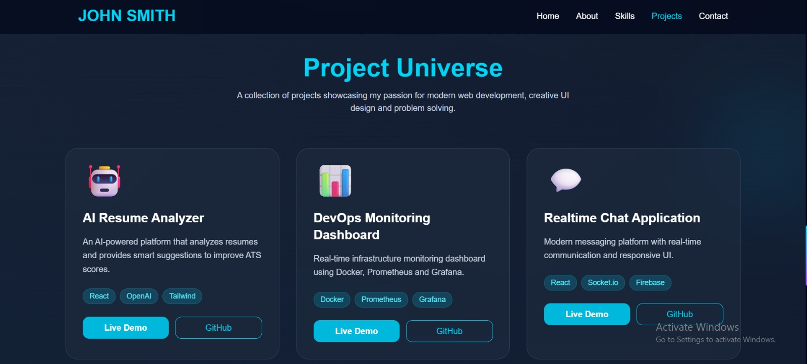
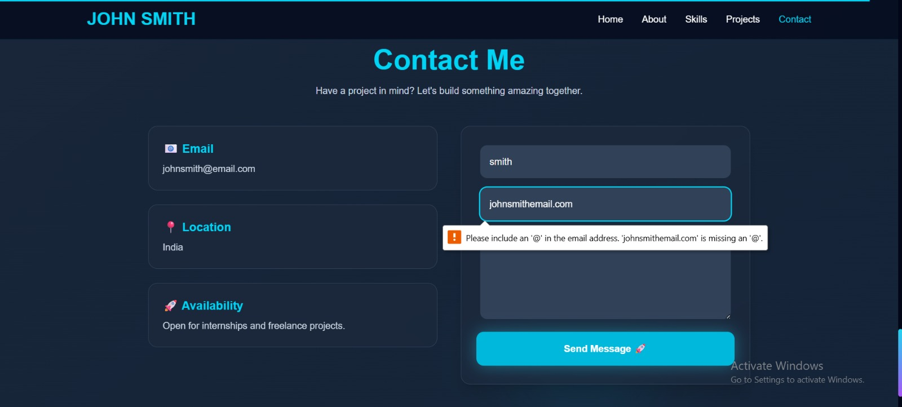
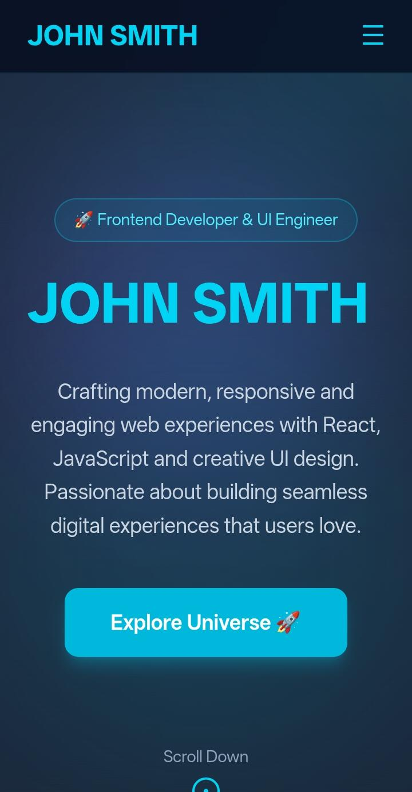
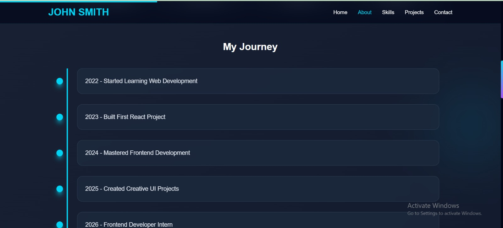

# 🚀 Animated Portfolio Website – John Smith

A modern React-based animated portfolio website built for a fictional frontend developer (**John Smith**) designed to create a strong first impression through smooth animations, interactive UI elements, and responsive design.

---

## 📌 Project Overview

A fictional creative professional needs a portfolio website that stands out through visual appeal and engaging user experience. This project solves that problem by combining modern UI design, smooth animations, and responsive layouts into a single-page portfolio application.

The application includes:

* Animated Hero section
* Professional About section
* Interactive Skills showcase
* Animated Projects section
* Contact form with validation
* Smooth scrolling navigation
* Active navbar highlighting
* Cursor glow effect
* Scroll progress indicator
* Fully responsive design

---

## 🚀 Features

### 🏠 Hero Section

* Animated typing effect
* Animated background glow effects
* Interactive call-to-action button
* Smooth entrance animations

### 👨‍💻 About Section

* Professional introduction
* Statistics cards
* Career timeline
* Animated content reveal

### ⚡ Skills Section

* Animated skill progress bars
* Categorized technologies
* Interactive hover effects

### 🚀 Projects Section

* Project showcase cards
* Hover animations
* Technology stack badges
* Interactive UI elements

### 📞 Contact Section

* Contact form
* Client-side validation
* Responsive layout

---

## 🎨 UI Features

* Dark futuristic theme
* Cursor glow effect
* Active navbar highlighting
* Scroll progress indicator
* Smooth scrolling
* Glassmorphism-inspired UI
* Framer Motion animations
* Interactive hover effects
* Fully responsive design

---

## ⚡ Performance Features

* Smooth page transitions
* Section reveal animations
* Optimized component structure
* Responsive rendering
* Client-side validation
* Lightweight architecture

---

## ✅ Task Requirements Checklist

| Requirement              | Status |
| ------------------------ | ------ |
| Hero Section             | ✅      |
| About Section            | ✅      |
| Skills Section           | ✅      |
| Projects Section         | ✅      |
| Contact Section          | ✅      |
| Meaningful Animations    | ✅      |
| Smooth Scroll Navigation | ✅      |
| Fully Responsive Design  | ✅      |
| Client-side Validation   | ✅      |

---

## 🛠️ Tech Stack

### Frontend

* React.js
* Vite
* JavaScript

### Styling

* Tailwind CSS

### Animation Libraries

* Framer Motion
* React Type Animation

---

## 📂 Project Structure

```text
src/
│
├── components/
│   ├── Navbar.jsx
│   ├── Hero.jsx
│   ├── About.jsx
│   ├── Skills.jsx
│   ├── Projects.jsx
│   ├── Contact.jsx
│   ├── Footer.jsx
│   ├── CursorGlow.jsx
│   └── ScrollProgress.jsx
│
├── App.jsx
├── App.css
├── main.jsx
└── index.css
```

---

## ⚙️ Installation & Setup

### Prerequisites

Install:

* Node.js
* npm
* Git
* VS Code (recommended)

Check versions:

```bash
node -v
npm -v
git --version
```

---

### Clone Repository

```bash
git clone https://github.com/Abzal31640/azentrix-fullstack-task1.git
```

---

### Navigate to Project

```bash
cd azentrix-fullstack-task1
```

---

### Install Dependencies

```bash
npm install
```

---

### Additional Libraries Used

#### Framer Motion

```bash
npm install framer-motion
```

#### React Type Animation

```bash
npm install react-type-animation
```

#### Optional Packages

##### React Icons

```bash
npm install react-icons
```

##### React CountUp

```bash
npm install react-countup
```

---

### Run Development Server

```bash
npm run dev
```

Application will start at:

```text
http://localhost:5173
```

---

### Create Production Build

```bash
npm run build
```

---

### Preview Production Build

```bash
npm run preview
```

---

## 📸 Screenshots

### 🏠 Hero/Home Section


### 👤 About Section


### ⚡ Skills Section


### 🚀 Projects Section


### 📞 Contact Section


### 📱 Mobile View


### 🛤️ Journey Section



## 💡 Development Approach

This project was developed with a focus on:

* Creating a strong visual first impression
* Implementing meaningful animations
* Following modern UI/UX principles
* Building reusable React components
* Maintaining responsive layouts
* Writing clean and maintainable code

The overall design follows a futuristic aesthetic using glow effects, dark themes, and smooth transitions to create an engaging user experience.

---

## 📱 Responsive Design

The website is optimized for:

* 💻 Desktop
* 📱 Tablet
* 📱 Mobile

---

## 🎥 Demo Video

Loom Video:

LOOM_VIDEO_LINK_HERE

---

## 👨‍💻 Author

**NEEHA Abzal**

GitHub Username: **Abzal31640**

GitHub:
https://github.com/Abzal31640

Repository:
https://github.com/Abzal31640/azentrix-fullstack-task1

---

## 📄 License

This project was developed for educational and internship evaluation purposes.

---
© Copyright

  © 2026 Neeha Abzal. All Rights Reserved.

